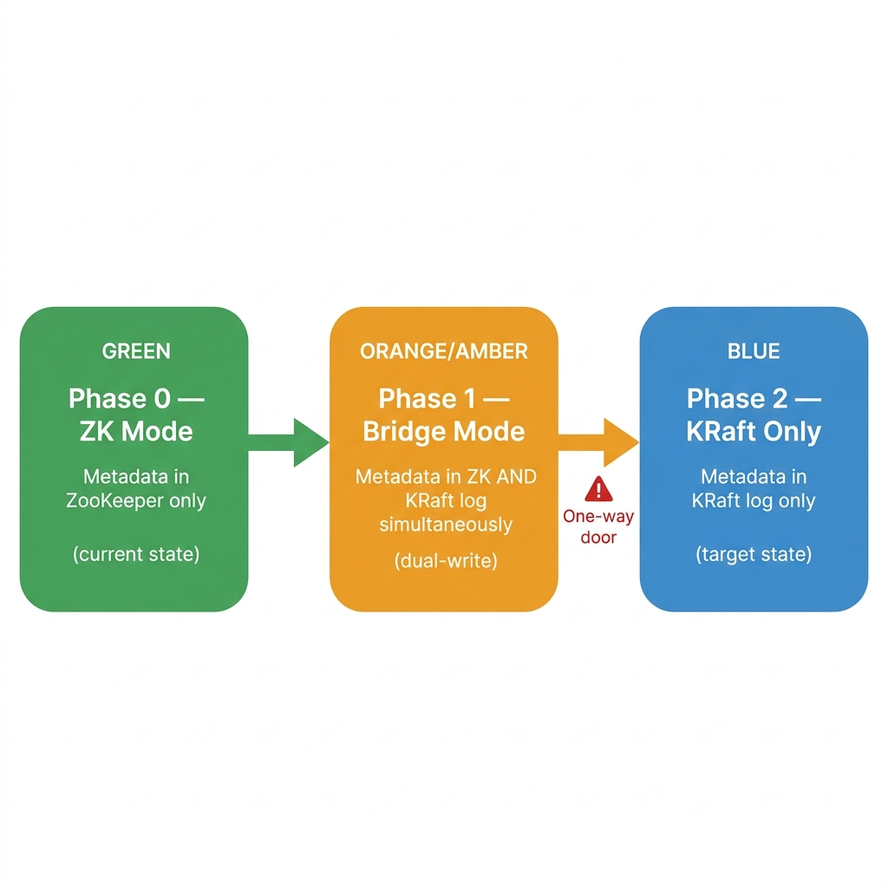
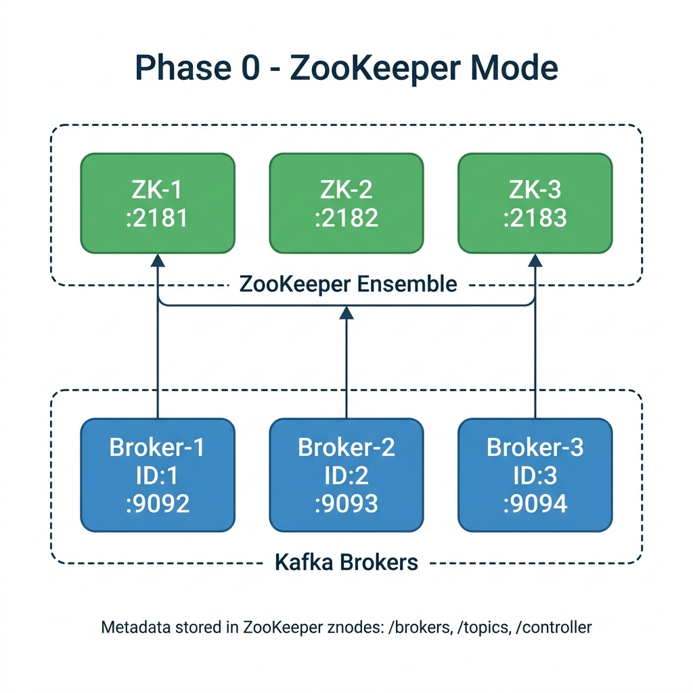
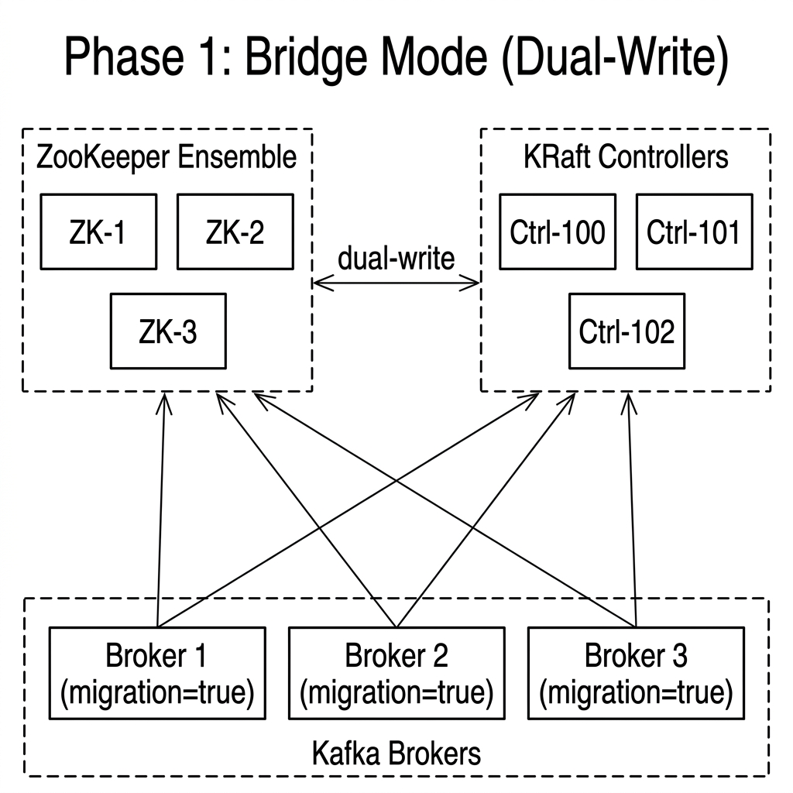
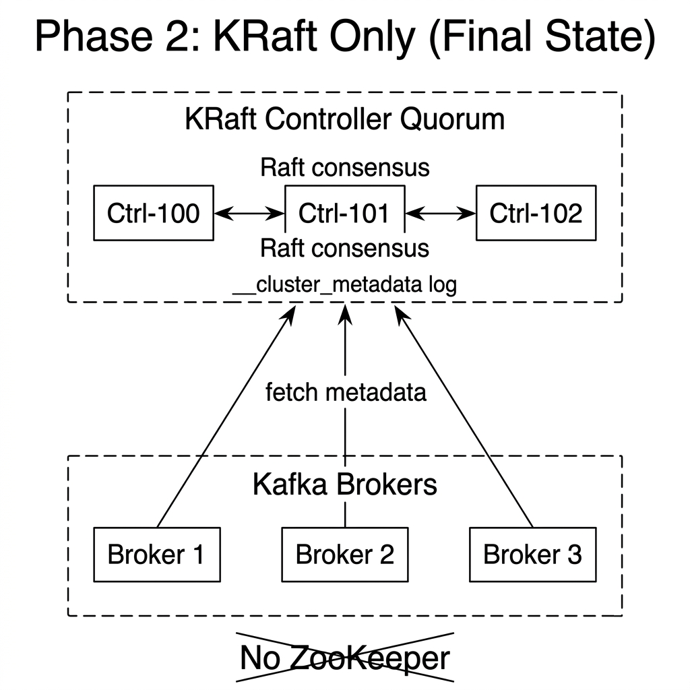

# ZooKeeper → KRaft Migration Guide

> **Apache Kafka 3.9.2** — the last version supporting both ZooKeeper and KRaft.
> Starting with Kafka 4.0, ZooKeeper support has been **completely removed** from the codebase.
> You **must** complete the migration on a 3.7+ / 3.9.x release before upgrading to 4.x.

---

## Table of Contents

1. [Why Migrate?](#1-why-migrate)
2. [Understanding the Migration Model](#2-understanding-the-migration-model)
3. [Prerequisites](#3-prerequisites)
4. [Architecture Overview](#4-architecture-overview)
5. [Phase 0 — Baseline: Running ZooKeeper Cluster](#5-phase-0--baseline-running-zookeeper-cluster)
6. [Phase 0.5 — Extract and Preserve the Cluster ID](#6-phase-05--extract-and-preserve-the-cluster-id)
7. [Phase 1 — Bridge Mode (Dual-Write)](#7-phase-1--bridge-mode-dual-write)
8. [Phase 2 — Finalize the Migration (One-Way Door)](#8-phase-2--finalize-the-migration-one-way-door)
9. [Phase 3 — Post-Migration Validation](#9-phase-3--post-migration-validation)
10. [Upgrade Path to Kafka 4.x](#10-upgrade-path-to-kafka-4x)
11. [Key Configuration Reference](#11-key-configuration-reference)
12. [Mistakes to Avoid](#12-mistakes-to-avoid)
13. [Troubleshooting](#13-troubleshooting)
14. [Quick Start (Automated Demo)](#14-quick-start-automated-demo)
15. [File Structure](#15-file-structure)

---

## 1. Why Migrate?

Apache Kafka's reliance on ZooKeeper has been its biggest operational burden since day one. ZooKeeper is a separate distributed system with its own deployment, tuning, monitoring, and failure modes. Running Kafka in production means operating **two** distributed systems simultaneously.

KRaft (Kafka Raft) eliminates this entirely by storing all cluster metadata inside Kafka itself, using a Raft-based consensus protocol. The benefits are significant:

| Aspect | With ZooKeeper | With KRaft |
|---|---|---|
| **Deployment** | Two separate clusters to deploy, version-match, and secure | One system |
| **Scalability** | ~200K partitions practical limit (ZK becomes a bottleneck) | Millions of partitions |
| **Failover** | Controller failover can take minutes (full metadata reload from ZK) | Seconds (metadata already in memory via log tailing) |
| **Operational burden** | Two sets of runbooks, dashboards, alerts, on-call rotations | One |
| **Security** | Kafka SASL/SSL + ZooKeeper ACLs (completely different security models) | Single security model |
| **Rolling upgrades** | Upgrade ZK first, then Kafka | Upgrade Kafka only |

**Bottom line:** If you are running Kafka in production, this migration is not optional — it is a matter of *when*, not *if*. Kafka 4.0 has already removed ZooKeeper entirely.

---

## 2. Understanding the Migration Model

The migration is a **phased, rolling process** designed to be performed with **zero downtime**. It is critical to understand what happens at each phase before you begin.

### The Three Phases



### What is "Bridge Mode"?

Bridge mode (also called "dual-write" or "migration mode") is the critical transitional phase:

1. **KRaft controllers** are deployed alongside the existing ZooKeeper ensemble.
2. The **Active Controller** (KRaft leader) reads the entire metadata tree from ZooKeeper.
3. Every metadata change is written to **both** ZooKeeper and the `__cluster_metadata` topic.
4. Brokers are configured with `zookeeper.metadata.migration.enable=true`, which tells them to register with the KRaft controller quorum while still maintaining their ZooKeeper connection.

This phase is fully reversible — you can roll back to pure ZooKeeper mode by simply stopping the KRaft controllers and removing the migration flag from the broker configs.

### What is "Finalization"?

Finalization is the **one-way door**. Once you finalize:

- The KRaft controllers stop writing to ZooKeeper.
- The `__cluster_metadata` log becomes the **sole source of truth**.
- There is **no rollback** to ZooKeeper. Ever.

> ⚠️ **This is the single most important thing to understand about this migration.** Test finalization in a staging environment that mirrors production before doing it for real.

---

## 3. Prerequisites

### Software Requirements

| Requirement | Minimum | Recommended |
|---|---|---|
| **Docker** | Docker 24+ with Compose V2 | Latest stable |
| **Kafka version** | 3.7.0 | **3.9.2** (latest with ZK+KRaft support) |
| **ZooKeeper version** | 3.8.x | 3.9.x |
| **Disk space** | 2 GB (images + volumes) | 5 GB (with headroom) |
| **Available ports** | 2181-2183, 9092-9094 | Check with `lsof -i` |

### Operational Requirements

Before starting the migration, ensure:

1. **All brokers are on the same Kafka version.** Mixed-version clusters are a recipe for disaster. If you are on Kafka 3.5 or earlier, upgrade to 3.9.2 first, stabilize for at least a week, then begin migration.

2. **`inter.broker.protocol.version` is set explicitly.** This controls the wire protocol between brokers. It must match your target Kafka version. For 3.9.2, use `"3.9"`.

3. **No pending partition reassignments.** Check with:
   ```bash
   kafka-reassign-partitions.sh --verify --reassignment-json-file <file>
   ```

4. **All partitions have ISR count == replication factor.** Under-replicated partitions during migration can lead to data loss.

5. **ZooKeeper is healthy.** Run the four-letter commands (`ruok`, `stat`, `mntr`) on every ZK node. All nodes must be part of the ensemble and responding.

6. **Full backup of ZooKeeper data.** Take a snapshot of ZK data directories *before* you touch anything:
   ```bash
   # On each ZK node:
   cp -r /var/zookeeper/data /backup/zk-data-$(date +%Y%m%d)
   cp -r /var/zookeeper/log  /backup/zk-log-$(date +%Y%m%d)
   ```

7. **Client readiness check.** If you have legacy clients that connect directly to ZooKeeper (e.g., old consumers using `--zookeeper` flag), they **must** be migrated to the bootstrap-server API before you start. These ancient patterns were deprecated years ago, but some shops still have them.

---

## 4. Architecture Overview

### Phase 0 — Starting Point (ZooKeeper Mode)



Metadata is stored entirely in ZooKeeper znodes (`/brokers`, `/topics`, `/controller`, `/config`, etc.). All three Kafka brokers connect to the ZooKeeper ensemble to read and write cluster state.

### Phase 1 — Bridge Mode (Dual-Write)



Three KRaft controllers are deployed alongside the existing ZooKeeper ensemble. Brokers are configured with `migration=true`, causing metadata to be dual-written to **both** ZooKeeper and the `__cluster_metadata` Raft log. This phase is **reversible** — you can roll back to pure ZooKeeper mode.

### Phase 2 — KRaft Only (Final State)



ZooKeeper has been completely removed. The KRaft controller quorum is the sole source of truth via Raft consensus. Brokers tail the `__cluster_metadata` log for all cluster state. **This is irreversible.**

---

## 5. Phase 0 — Baseline: Running ZooKeeper Cluster

This phase establishes the starting point: a healthy ZooKeeper-based Kafka 3.9.2 cluster with test data.

### Step 0.1 — Start the ZooKeeper Cluster

```bash
docker compose -f docker-compose-zk.yml up -d
```

This starts:
- **3 ZooKeeper nodes** (`zookeeper-1`, `zookeeper-2`, `zookeeper-3`) forming an ensemble
- **3 Kafka brokers** (`broker-1`, `broker-2`, `broker-3`) connected to ZooKeeper

### Step 0.2 — Wait for Stabilization

ZooKeeper needs time to elect a leader and for brokers to register. This is not optional.

```bash
# Wait at least 30 seconds
sleep 30
```

**How to verify the cluster is healthy:**

```bash
# Check that all 3 brokers have registered with ZooKeeper
docker exec broker-1 /opt/kafka/bin/kafka-broker-api-versions.sh \
  --bootstrap-server broker-1:29092 2>/dev/null | grep "id:" | wc -l
# Expected: 3
```

### Step 0.3 — Create Test Data

We create a test topic and produce messages to it. This data **must** survive the migration — it is our validation checkpoint.

```bash
# Create a topic with 6 partitions and replication factor 3
docker exec broker-1 /opt/kafka/bin/kafka-topics.sh \
  --bootstrap-server broker-1:29092 \
  --create \
  --topic migration-test \
  --partitions 6 \
  --replication-factor 3

# Produce exactly 100 messages
docker exec broker-1 bash -c '
  for i in $(seq 1 100); do
    echo "message-$i"
  done | /opt/kafka/bin/kafka-console-producer.sh \
    --bootstrap-server broker-1:29092 \
    --topic migration-test
'
```

### Step 0.4 — Verify the Baseline

Before moving to the next phase, verify everything is working correctly:

```bash
# Verify topic exists and is fully replicated
docker exec broker-1 /opt/kafka/bin/kafka-topics.sh \
  --bootstrap-server broker-1:29092 \
  --describe \
  --topic migration-test
```

You should see output like:
```
Topic: migration-test   PartitionCount: 6       ReplicationFactor: 3
  Partition: 0  Leader: 1  Replicas: 1,2,3  Isr: 1,2,3
  Partition: 1  Leader: 2  Replicas: 2,3,1  Isr: 2,3,1
  ...
```

**Critically check:** The `Isr` (In-Sync Replicas) column must equal the `Replicas` column for every partition. If any partition shows fewer ISR members than replicas, **stop here and fix the under-replication before proceeding.**

```bash
# Verify all 100 messages are consumable
docker exec broker-1 /opt/kafka/bin/kafka-console-consumer.sh \
  --bootstrap-server broker-1:29092 \
  --topic migration-test \
  --from-beginning \
  --timeout-ms 15000 2>/dev/null | wc -l
# Expected: 100
```

✅ **Checkpoint:** 3 brokers healthy, topic fully replicated, 100 messages verified.

---

## 6. Phase 0.5 — Extract and Preserve the Cluster ID

This is a step many people skip or get wrong, and it is **the most common cause of migration failure**.

### Why This Matters

Every Kafka cluster has a unique `cluster.id`. This ID is stored in ZooKeeper at the znode `/cluster/id`. When you deploy KRaft controllers, they **must** be initialized with the **exact same cluster ID**. If the IDs do not match, brokers will refuse to register with the KRaft controllers, and you will see cryptic errors like:

```
ClusterIdMismatchException: The cluster ID xyz does not match the expected cluster ID abc
```

### Step 0.5.1 — Extract the Cluster ID from ZooKeeper

```bash
# Read the cluster ID from ZooKeeper
docker exec zookeeper-1 bash -c '
  echo "get /cluster/id" | /opt/bitnami/zookeeper/bin/zkCli.sh \
    -server localhost:2181 2>/dev/null \
  | grep -o '"'"'"id":"[^"]*"'"'"' | cut -d\" -f4
'
```

This will output something like: `MkU3OEVBNTcwNTJENDM2Qg`

### Step 0.5.2 — Save It

```bash
# Save the cluster ID for use in subsequent phases
export CLUSTER_ID="MkU3OEVBNTcwNTJENDM2Qg"  # Replace with YOUR value
echo "$CLUSTER_ID" > .cluster-id
```

The `.cluster-id` file is used by our Docker Compose files (via the `${CLUSTER_ID}` environment variable).

### Step 0.5.3 — Verify the Cluster ID

Double-check by reading it from a broker's `meta.properties` file:

```bash
docker exec broker-1 cat /var/kafka/data/meta.properties
```

You should see:
```
cluster.id=MkU3OEVBNTcwNTJENDM2Qg
broker.id=1
version=0
```

The `cluster.id` here **must** match exactly what you extracted from ZooKeeper.

> ⚠️ **Mistake to avoid:** Never generate a new random cluster ID with `kafka-storage.sh random-uuid` for the migration. This is only for brand-new clusters. Reusing the existing ID is mandatory.

---

## 7. Phase 1 — Bridge Mode (Dual-Write)

This is the most delicate phase of the migration. You are running two metadata systems simultaneously.

### What Changes in This Phase

| Component | Change |
|---|---|
| **ZooKeeper ensemble** | No changes — still running |
| **KRaft controllers** | NEW — 3 dedicated controller nodes are deployed |
| **Brokers** | Three new config properties added (see below) |

### New Broker Configuration Properties

These three properties are added to **every broker** for Bridge Mode:

```properties
# 1. Tells the broker where the KRaft controllers are
controller.quorum.voters=100@controller-1:9093,101@controller-2:9093,102@controller-3:9093

# 2. Names the listener used for controller communication
controller.listener.names=CONTROLLER

# 3. THE MIGRATION FLAG — enables dual-write mode
zookeeper.metadata.migration.enable=true
```

**Important:** The `zookeeper.connect` property is **NOT** removed during this phase. Brokers need it to continue reading from and writing to ZooKeeper alongside the new KRaft controllers.

### Node ID Strategy

This is crucial and must be planned before you start:

| Role | ID Range | Rationale |
|---|---|---|
| **Brokers** | 1–99 | Keep the exact same broker IDs they already have. Changing broker IDs would reassign all partition leadership and break your cluster. |
| **Controllers** | 100–102 | Use a completely separate namespace. This avoids any collision with existing broker IDs. |

> ⚠️ **Mistake to avoid:** Never assign a controller the same `node.id` as an existing broker. In KRaft, both brokers and controllers share the same ID namespace. A collision will cause a `DuplicateNodeIdException` and the node will refuse to start.

### Step 1.1 — Stop the ZK-Only Cluster

```bash
docker compose -f docker-compose-zk.yml down
```

> **Note:** In a real production environment, you would NOT stop the entire cluster. Instead, you would perform a **rolling restart**: add the new configuration properties to each broker one at a time, restart it, verify it rejoins the cluster, then move to the next broker. The Docker Compose approach here stops and restarts everything at once for demo simplicity.

### Step 1.2 — Start Bridge Mode

```bash
# Ensure the CLUSTER_ID is set
export CLUSTER_ID=$(cat .cluster-id)

# Start the bridge mode cluster
docker compose -f docker-compose-bridge.yml up -d
```

This starts:
- **3 ZooKeeper nodes** (unchanged)
- **3 KRaft controllers** (NEW — node IDs 100, 101, 102)
- **3 Kafka brokers** (with migration enabled)

### Step 1.3 — Wait for Metadata Synchronization

This is not a "nice to have" wait. The KRaft controllers must:
1. Form a Raft quorum (elect a leader among themselves)
2. Read the entire metadata tree from ZooKeeper
3. Replay it into the `__cluster_metadata` log
4. Begin accepting broker registrations

```bash
# Wait at least 45 seconds for large clusters, 30 for small ones
sleep 45
```

### Step 1.4 — Verify Bridge Mode is Active

```bash
# Check that brokers are registered and topics exist
docker exec broker-1 /opt/kafka/bin/kafka-topics.sh \
  --bootstrap-server broker-1:29092 \
  --describe --topic migration-test
```

Verify:
- All partitions show correct replicas and ISR
- Leader assignment is intact
- No under-replicated partitions

```bash
# Verify data integrity — consume the 100 messages
docker exec broker-1 /opt/kafka/bin/kafka-console-consumer.sh \
  --bootstrap-server broker-1:29092 \
  --topic migration-test \
  --from-beginning \
  --timeout-ms 15000 2>/dev/null | wc -l
# Expected: 100
```

### Step 1.5 — Test Produce and Consume in Bridge Mode

It is essential to verify that the cluster is fully operational in bridge mode before moving forward:

```bash
# Produce new messages while in bridge mode
docker exec broker-1 bash -c '
  for i in $(seq 101 120); do
    echo "bridge-mode-message-$i"
  done | /opt/kafka/bin/kafka-console-producer.sh \
    --bootstrap-server broker-1:29092 \
    --topic migration-test
'

# Consume all messages (should now be 120)
docker exec broker-1 /opt/kafka/bin/kafka-console-consumer.sh \
  --bootstrap-server broker-1:29092 \
  --topic migration-test \
  --from-beginning \
  --timeout-ms 15000 2>/dev/null | wc -l
# Expected: 120
```

### Step 1.6 — How Long to Stay in Bridge Mode

In production, you should stay in bridge mode for **at least 24–48 hours** (ideally a full business cycle) to verify:

- No metadata synchronization errors in controller logs
- No under-replicated partitions
- Producer and consumer throughput is normal
- Topic creation and deletion works correctly
- Consumer group offsets are being managed properly
- No increase in latency metrics

**Monitor these JMX metrics on the controllers:**
- `kafka.controller:type=KafkaController,name=ZkMigrationState` — should be `MIGRATION` (value 1)
- `kafka.controller:type=KafkaController,name=ActiveControllerCount` — exactly 1 controller should report this as 1

✅ **Checkpoint:** Cluster fully operational in bridge mode. All data intact. Produces and consumes working. No errors in logs.

---

## 8. Phase 2 — Finalize the Migration (One-Way Door)

> ⛔ **THIS IS IRREVERSIBLE.** Once you complete this step, you cannot go back to ZooKeeper. There is no "undo". If you are not 100% confident that bridge mode is stable, **stay in bridge mode longer**.

### What Finalization Does

1. The KRaft Active Controller stops writing metadata changes to ZooKeeper.
2. The `__cluster_metadata` log becomes the sole source of truth.
3. The `zookeeper.connect` property is removed from all broker configurations.
4. ZooKeeper nodes can be safely decommissioned.

### Step 2.1 — Final Pre-Flight Checks

Before finalizing, run through this checklist:

- [ ] Bridge mode has been running for at least 24 hours without issues
- [ ] No under-replicated partitions: `kafka-topics.sh --describe --under-replicated-partitions`
- [ ] Controller logs show no `WARN` or `ERROR` related to metadata sync
- [ ] All consumer groups are active and consuming
- [ ] Producer throughput is at baseline levels
- [ ] You have a **tested disaster recovery plan** (you cannot roll back, but you must be able to restore from backups if needed)

### Step 2.2 — Finalize

```bash
# Stop the bridge mode cluster
docker compose -f docker-compose-bridge.yml down

# Start KRaft-only cluster (no ZooKeeper services at all)
export CLUSTER_ID=$(cat .cluster-id)
docker compose -f docker-compose-kraft.yml up -d

# Wait for stabilization
sleep 30
```

> **In production:** The finalization is done by removing `zookeeper.connect` and `zookeeper.metadata.migration.enable` from all broker configs, then performing a rolling restart. The KRaft controllers also need their migration properties removed and a rolling restart.

### Step 2.3 — Verify ZooKeeper is Gone

```bash
# Confirm no ZooKeeper containers are running
docker ps --filter "name=zookeeper" --format "{{.Names}}"
# Expected: (empty output)

# Confirm only KRaft controllers and brokers are running
docker ps --format "table {{.Names}}\t{{.Status}}"
```

You should see exactly 6 containers: 3 controllers and 3 brokers.

---

## 9. Phase 3 — Post-Migration Validation

This is the most important phase after finalization. You must thoroughly verify that absolutely everything works.

### Step 3.1 — Verify Topics and Partitions

```bash
# List all topics
docker exec broker-1 /opt/kafka/bin/kafka-topics.sh \
  --bootstrap-server broker-1:29092 \
  --list

# Describe the test topic in detail
docker exec broker-1 /opt/kafka/bin/kafka-topics.sh \
  --bootstrap-server broker-1:29092 \
  --describe --topic migration-test
```

Verify:
- Topic exists
- Partition count is correct (6)
- Replication factor is correct (3)
- All partitions have ISR == Replicas
- Leader distribution is balanced

### Step 3.2 — Verify Data Integrity

```bash
# Consume all messages from the beginning
docker exec broker-1 /opt/kafka/bin/kafka-console-consumer.sh \
  --bootstrap-server broker-1:29092 \
  --topic migration-test \
  --from-beginning \
  --timeout-ms 15000 2>/dev/null | wc -l
# Expected: 120 (100 from Phase 0 + 20 from Bridge Mode)
```

### Step 3.3 — Verify Write Path

```bash
# Produce new messages post-migration
docker exec broker-1 bash -c '
  for i in $(seq 121 130); do
    echo "post-kraft-message-$i"
  done | /opt/kafka/bin/kafka-console-producer.sh \
    --bootstrap-server broker-1:29092 \
    --topic migration-test
'
```

### Step 3.4 — Verify Topic Management

```bash
# Create a new topic (tests the metadata write path through KRaft)
docker exec broker-1 /opt/kafka/bin/kafka-topics.sh \
  --bootstrap-server broker-1:29092 \
  --create \
  --topic post-migration-topic \
  --partitions 3 \
  --replication-factor 3

# Verify it was created
docker exec broker-1 /opt/kafka/bin/kafka-topics.sh \
  --bootstrap-server broker-1:29092 \
  --describe --topic post-migration-topic

# Clean up
docker exec broker-1 /opt/kafka/bin/kafka-topics.sh \
  --bootstrap-server broker-1:29092 \
  --delete --topic post-migration-topic
```

### Step 3.5 — Verify Consumer Groups

```bash
# List consumer groups
docker exec broker-1 /opt/kafka/bin/kafka-consumer-groups.sh \
  --bootstrap-server broker-1:29092 \
  --list
```

✅ **Final Checkpoint:** All data intact, writes working, topic management functional, no ZooKeeper.

---

## 10. Upgrade Path to Kafka 4.x

Once your cluster is running KRaft-only on Kafka 3.9.2, upgrading to Kafka 4.x is a **standard rolling upgrade** — no special migration steps needed.

### Steps

1. **Update the image tag** in your compose file:
   ```yaml
   # From:
   image: apache/kafka:3.9.2
   # To:
   image: apache/kafka:4.2.0
   ```

2. **Rolling restart controllers first**, then brokers — one at a time, verifying cluster health after each restart.

3. **Remove legacy properties** that are no longer needed in 4.x (the ZK-related ones were already removed during migration).

> ⚠️ **Critical:** Kafka 4.0 removed ALL ZooKeeper code from the codebase. You **cannot** upgrade from a ZooKeeper-based cluster directly to 4.x. You must complete the KRaft migration on 3.9.x first.

---

## 11. Key Configuration Reference

### Broker Config Across All Phases

| Property | ZK Mode | Bridge Mode | KRaft Mode |
|---|---|---|---|
| `process.roles` | *(empty/absent)* | *(empty/absent)* | `broker` |
| `zookeeper.connect` | `zk1:2181,zk2:2181,zk3:2181` | `zk1:2181,zk2:2181,zk3:2181` | ❌ **removed** |
| `controller.quorum.voters` | ❌ absent | `100@ctrl1:9093,...` | `100@ctrl1:9093,...` |
| `controller.listener.names` | ❌ absent | `CONTROLLER` | `CONTROLLER` |
| `zookeeper.metadata.migration.enable` | ❌ absent | `true` | ❌ **removed** |
| `inter.broker.protocol.version` | `"3.9"` | `"3.9"` | `"3.9"` |
| `listener.security.protocol.map` | `PLAINTEXT:PLAINTEXT,...` | `...,CONTROLLER:PLAINTEXT` | `...,CONTROLLER:PLAINTEXT` |

### Controller Config (KRaft Only)

```properties
process.roles=controller
node.id=100                            # 100, 101, or 102
controller.quorum.voters=100@controller-1:9093,101@controller-2:9093,102@controller-3:9093
listeners=CONTROLLER://0.0.0.0:9093
controller.listener.names=CONTROLLER
listener.security.protocol.map=CONTROLLER:PLAINTEXT
log.dirs=/var/kafka/metadata
cluster.id=<YOUR_CLUSTER_ID>           # MUST match ZK cluster ID
```

---

## 12. Mistakes to Avoid

This section summarizes the most common errors that cause migration failures. Read it before you start.

### 🔴 Mistake 1: Using a Different Cluster ID

**What happens:** Brokers refuse to register with KRaft controllers. You see `ClusterIdMismatchException` in the logs.

**How to avoid:** Always extract the cluster ID from ZooKeeper (see Phase 0.5). Never use `kafka-storage.sh random-uuid` for migration — that is only for new clusters.

---

### 🔴 Mistake 2: Node ID Collisions

**What happens:** Controllers and brokers fight over the same ID. Nodes refuse to start with `DuplicateNodeIdException`.

**How to avoid:** Use a completely separate ID range for controllers (e.g., 100+) that does not overlap with any existing broker ID.

---

### 🔴 Mistake 3: Skipping the Bridge Mode Validation

**What happens:** You finalize too quickly, discover a problem, and realize you cannot roll back.

**How to avoid:** Stay in bridge mode for at least 24–48 hours. Monitor logs, metrics, throughput, and latency. Only finalize when you are completely confident.

---

### 🔴 Mistake 4: Running Combined Mode in Production

**What happens:** A single node runs as both broker AND controller (`process.roles=broker,controller`). Under load, the controller responsibilities compete with broker I/O, leading to election timeouts and metadata delays.

**How to avoid:** **Always** use dedicated controller nodes in production. Combined mode is for development and testing only.

---

### 🔴 Mistake 5: Forgetting to Add CONTROLLER to the Listener Security Protocol Map

**What happens:** Brokers cannot communicate with controllers. You see connection refused errors or SSL handshake failures.

**How to avoid:** Every broker's `listener.security.protocol.map` must include the `CONTROLLER` listener:
```properties
listener.security.protocol.map=PLAINTEXT:PLAINTEXT,INTERNAL:PLAINTEXT,CONTROLLER:PLAINTEXT
```

---

### 🔴 Mistake 6: Mixed Kafka Versions

**What happens:** Brokers on different versions interpret metadata differently. You get mysterious serialization errors, partition assignment failures, or data loss.

**How to avoid:** Ensure ALL brokers are on the exact same Kafka version (3.9.2) before beginning migration. Upgrade stragglers first.

---

### 🔴 Mistake 7: Under-Replicated Partitions at Migration Time

**What happens:** Partitions with fewer ISR members than the replication factor are at risk of data loss during the metadata transition.

**How to avoid:** Before starting, check for under-replicated partitions:
```bash
kafka-topics.sh --describe --under-replicated-partitions --bootstrap-server broker:9092
```
Fix any issues before proceeding.

---

### 🔴 Mistake 8: Slow Disks on Controller Nodes

**What happens:** Controllers use disk I/O to persist the `__cluster_metadata` log. If the disk is slow (spinning HDD, shared NAS), Raft heartbeats time out, triggering unnecessary leader elections ("election storms").

**How to avoid:** Controllers MUST use fast local storage (SSD or NVMe). This is non-negotiable.

---

### 🔴 Mistake 9: Firewall Blocking Controller Ports

**What happens:** The KRaft controller quorum cannot form because nodes cannot reach each other on port 9093. Or brokers cannot reach controllers for metadata fetching.

**How to avoid:** Ensure port 9093 (or whatever you configure for the CONTROLLER listener) is open:
- Between all controller nodes (for Raft consensus)
- From all broker nodes to all controller nodes (for metadata tailing)

---

### 🔴 Mistake 10: Clients Still Using ZooKeeper Directly

**What happens:** Legacy consumers that used `--zookeeper` (deprecated since Kafka 0.9) break immediately because ZooKeeper is no longer available.

**How to avoid:** Audit all clients before migration. Search your codebase for `zookeeper.connect` in client configurations. Migrate all clients to `bootstrap.servers` (the standard API since Kafka 0.9).

---

## 13. Troubleshooting

### Controller Won't Start

**Symptom:** Controller container exits immediately or loops in a restart cycle.

**Diagnosis:**
```bash
docker logs controller-1 2>&1 | tail -50
```

**Common causes:**
- Cluster ID mismatch (see Mistake 1)
- `log.dirs` directory not formatted — run `kafka-storage.sh format` first
- Port 9093 already in use
- Incorrect `controller.quorum.voters` format (must be `id@host:port`)

---

### Brokers "Stuck" in Migration

**Symptom:** Brokers start but topic operations fail or are extremely slow.

**Diagnosis:**
```bash
# Check broker logs for migration-related warnings
docker logs broker-1 2>&1 | grep -i "migrat" | tail -20
```

**Common causes:**
- Controllers haven't finished reading metadata from ZooKeeper
- `zookeeper.metadata.migration.enable` is not set to `true` on all brokers
- Network connectivity issue between brokers and controllers

---

### Metadata Sync Errors

**Symptom:** Controller logs show warnings about metadata inconsistency between ZK and KRaft.

**Diagnosis:**
```bash
docker logs controller-1 2>&1 | grep -i "error\|warn\|sync" | tail -30
```

**Resolution:** Usually resolves on its own after the Active Controller re-reads the full metadata tree. If it persists, try restarting the Active Controller:
```bash
docker restart controller-1
```

---

### Election Storms (Frequent Leader Changes)

**Symptom:** Controller leadership flaps between nodes rapidly. Broker logs show frequent metadata updates.

**Common causes:**
- Slow disk on one or more controller nodes
- Network latency between controllers exceeding `controller.quorum.election.timeout.ms`
- GC pauses on controller JVM (consider tuning heap size)

**Resolution:** Check disk I/O latency, network latency between controllers, and JVM GC logs.

---

## 14. Quick Start (Automated Demo)

For a live demo during a presentation, use the automated script:

```bash
# Make scripts executable
chmod +x migrate.sh cleanup.sh

# Run the full interactive migration (pauses at each phase)
./migrate.sh

# When done, tear down everything
./cleanup.sh
```

The `migrate.sh` script walks through all phases with colored output and pauses at each step so you can explain what is happening to the audience.

---

## 15. File Structure

```
demos/migration/
├── README.md                    # This guide
├── docker-compose-zk.yml       # Phase 0: ZooKeeper-based Kafka 3.9.2
├── docker-compose-bridge.yml   # Phase 1: Bridge mode (ZK + KRaft dual-write)
├── docker-compose-kraft.yml    # Phase 2: KRaft-only (no ZooKeeper)
├── migrate.sh                  # Interactive migration demo script
├── cleanup.sh                  # Tear down all containers and volumes
└── .cluster-id                 # Created at runtime — holds the cluster ID
```

---

## References

- [KIP-500: Replace ZooKeeper with a Self-Managed Metadata Quorum](https://cwiki.apache.org/confluence/display/KAFKA/KIP-500%3A+Replace+ZooKeeper+with+a+Self-Managed+Metadata+Quorum)
- [Apache Kafka Official Migration Documentation](https://kafka.apache.org/documentation/#kraft_zk_migration)
- [Strimzi Blog: From ZooKeeper to KRaft](https://strimzi.io/blog/2024/03/21/kraft-migration/)
- [Apache Kafka 4.0 Release Notes](https://kafka.apache.org/downloads)
