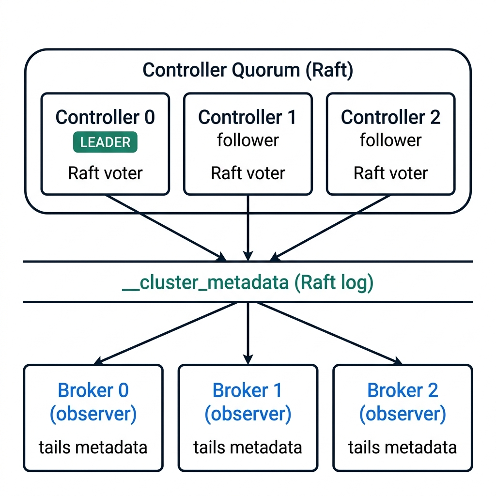

<!-- .slide: class="center-slide section-divider" data-background-color="#0c4a6e" -->

<div style="font-size: 3.5em; margin-bottom: 10px;">⚡</div>

## <span style="color: #67e8f9;">Raft</span> & <span style="color: #4ade80;">KRaft</span> <!-- .element: style="color: #e2e8f0;" -->

From understandable consensus to Kafka-native metadata <!-- .element: style="color: #94a3b8; font-size: 0.75em;" -->

Note:
Section divider. We leave ZooKeeper behind and enter the modern era of consensus.

---

<span class="tag tag-part">Part 3</span>

## <span class="accent-cyan">Raft</span>: The Consensus Revolution

2014 / Diego Ongaro &amp; John Ousterhout — Stanford <!-- .element: class="subtitle" -->

- <!-- .element: class="fragment" --> <em>"In Search of an <strong>Understandable</strong> Consensus Algorithm"</em>
- <!-- .element: class="fragment" --> Thesis: <strong><span class="accent-purple">Paxos is correct but incomprehensible</span></strong>
  - User study: 43 students learned both → Raft scores <strong>significantly better</strong>
- <!-- .element: class="fragment" --> Design principle: <em>"If you can't understand the protocol, you can't implement it correctly, debug it, or operate it"</em>
- <!-- .element: class="fragment" --> Same safety guarantees as Multi-Paxos
- <!-- .element: class="fragment" --> Key insight: decompose consensus into <strong><span class="accent-cyan">three independent subproblems</span></strong>

Note:
Raft's whole reason for existing is understandability. The user study is compelling — same guarantees, but people actually understand it.

---

## Raft Subproblem 1: <span class="accent-cyan">Leader Election</span>

<div class="diagram-box" style="text-align: center; font-size: 0.6em;">
┌──────────┐  election timeout  ┌───────────┐  majority vote  ┌────────┐
│ <span class="accent-blue">Follower</span> │ ─────────────────► │ <span class="accent-yellow">Candidate</span> │ ──────────────► │ <span class="accent-green">Leader</span> │
└──────────┘                    └───────────┘                 └────────┘
     ▲                               │ │                          │
     │        discovers higher term  │ │   discovers higher term  │
     └───────────────────────────────┘ └──────────────────────────┘
</div>

- <!-- .element: class="fragment" --> <strong>Terms</strong>: monotonically increasing epoch number — logical clock
- <!-- .element: class="fragment" --> Follower's election timer expires (randomized: `150–300ms`) → becomes <strong><span class="accent-yellow">Candidate</span></strong>
- <!-- .element: class="fragment" --> Candidate votes for itself, sends `RequestVote(term, lastLogIndex, lastLogTerm)`
- <!-- .element: class="fragment" --> Peer grants vote if: term ≥ own <strong>AND</strong> candidate's log is at least as up-to-date
- <!-- .element: class="fragment" --> Majority → becomes <strong><span class="accent-green">Leader</span></strong>, starts heartbeats
- <!-- .element: class="fragment" --> <strong><span class="accent-cyan">Random timeout</span></strong> prevents split-vote livelocks — contrast with Paxos dueling proposers!

Note:
Draw the contrast with Paxos explicitly. The random timeout is elegant — it solves the dueling proposers problem they just saw.

---

## Raft Subproblem 2: <span class="accent-cyan">Log Replication</span>

The heart of Raft — and the heart of KRaft <!-- .element: class="subtitle" -->

<div class="split-layout" style="margin-top: 18px; gap: 36px; align-items: flex-start;">
<div class="split-left">

<div class="diagram-box" style="font-size: 0.65em; line-height: 2.0;">
 Index │ Term │  Command
───────┼──────┼─────────────────
  1    │  1   │  <span class="accent-green">register broker 1</span>
  2    │  1   │  <span class="accent-green">create topic "orders"</span>
  3    │  2   │  <span class="accent-green">add partition 0</span>    ← <strong>committed ✓</strong>
  4    │  3   │  <span class="accent-yellow">add partition 1</span>    ← <em>pending…</em>
</div>

<div class="highlight-box" style="margin-top: 12px; font-size: 0.72em; padding: 12px 16px;">
✅ <strong>Committed</strong> = written on a <strong>majority</strong> → survives any crash<br>
⏳ <strong>Pending</strong> = not yet majority → <span class="accent-yellow">may be rolled back</span>
</div>

</div>
<div class="split-right">

<div class="card fragment" style="border-top: 3px solid var(--accent-green); margin-bottom: 10px;">
<h4 class="accent-green">① Append</h4>
<p>Client → <strong>Leader</strong>. Leader writes to its own log first.</p>
</div>
<div class="card fragment" style="border-top: 3px solid var(--accent-blue); margin-bottom: 10px;">
<h4 class="accent-blue">② Replicate</h4>
<p>Leader sends <code>AppendEntries</code> to all followers in parallel.</p>
</div>
<div class="card fragment" style="border-top: 3px solid var(--accent-cyan);">
<h4 class="accent-cyan">③ Commit</h4>
<p><strong>Majority ACK</strong> → leader advances <code>commitIndex</code> → reply to client ✅</p>
</div>

</div>
</div>

Note:
Go slow here. Use Kafka metadata as the example instead of generic SET commands — the audience connects it to KRaft immediately. Entry 3 is committed — survives any crash. Entry 4 is pending — can vanish if the leader dies now.

---

## Log Reconciliation After <span class="accent-red">Failure</span>

What happens when a leader crashes mid-replication? <!-- .element: class="subtitle" -->

<div class="diagram-box" style="font-size: 0.58em;">
Node A <span class="accent-red">(old leader, crashed)</span>:  [1:1] [2:1] [3:2] [4:2]
Node B <span class="accent-green">(new leader)</span>:           [1:1] [2:1] [3:2]
Node C (follower):             [1:1] [2:1] [3:2]
Node D (follower):             [1:1] [2:1]
Node E (follower):             [1:1] [2:1] [3:2]
</div>

- <!-- .element: class="fragment" --> Entry `[4:2]` was <strong>not committed</strong> (only on Node A) → can be safely overwritten
- <!-- .element: class="fragment" --> New leader (B) sends `AppendEntries` to Node D:
  - `prevLogIndex=2, prevLogTerm=1` → matches → appends `[3:2]` → logs converge
- <!-- .element: class="fragment" --> <strong><span class="accent-green">Safety guarantee</span></strong>: a committed entry (majority-replicated) can <strong>never</strong> be lost

This log reconciliation is <strong>exactly</strong> what KRaft does for Kafka metadata. <!-- .element: class="fragment" style="font-size: 0.8em; margin-top: 15px; color: #555;" -->

Note:
Make the connection to KRaft explicit. This same mechanism handles metadata recovery in Kafka now.

---

## Raft in Action: <span class="accent-cyan">Live Animation</span>

Visualizing leader election, log replication, and log reconciliation. <!-- .element: class="subtitle" -->

<div style="width: 100%; height: 550px; border: 2px solid #ccc; border-radius: 8px; overflow: hidden; margin-top: 20px; background: #fff;">
  <iframe data-src="raft-animation.html" width="100%" height="100%" style="border: none;"></iframe>
</div>

Note:
Use this interactive animation to walk the audience through the exact steps discussed. Click through the 14 steps to demonstrate a standard election, normal log replication, and the "slow node" partition/crash-recovery scenario.

---

## Raft: <span class="accent-cyan">Safety</span> Properties

<div class="card-grid three-col" style="margin-top: 25px;">
<div class="card fragment">
<h4 class="accent-cyan">Election Restriction</h4>
<p>Candidate's log must be at least as up-to-date as any majority member</p>
</div>
<div class="card fragment">
<h4 class="accent-cyan">Leader Completeness</h4>
<p>If an entry is committed in term T, it appears in all leaders for terms &gt; T</p>
</div>
<div class="card fragment">
<h4 class="accent-cyan">State Machine Safety</h4>
<p>If a node applies entry at index I, no other node applies a different entry at I</p>
</div>
</div>

<div class="highlight-box fragment" style="margin-top: 25px; text-align: center;">
<p style="font-size: 0.9em; margin: 0;">Once Raft commits a value, it <strong>stays committed forever</strong>.</p>
</div>

Note:
These guarantees are what make KRaft safe for Kafka metadata. When a topic record is committed, it won't vanish.

---

## <span class="accent-purple">Paxos</span> vs <span class="accent-cyan">Raft</span>

| Aspect | <span class="accent-purple">Paxos</span> | <span class="accent-cyan">Raft</span> |
|--------|-------|------|
| <strong>Year</strong> | 1989 / 1998 | 2014 |
| <strong>Design goal</strong> | Correctness proof | Understandability |
| <strong>Leader</strong> | Optional, weak | Mandatory, strong |
| <strong>Agreement unit</strong> | Single value | Ordered log entries |
| <strong>Steady state</strong> | 2 RTT (Prepare + Accept) | 1 RTT (AppendEntries) |
| <strong>Log ordering</strong> | Unspecified | Strictly sequential |
| <strong>Membership</strong> | Underspecified | Joint consensus |
| <strong>Failure mode</strong> | Dueling proposers → livelock | Random timeout → fast re-election |
| <strong>Implementations</strong> | Chubby, Spanner | etcd, CockroachDB, <strong><span class="accent-green">KRaft</span></strong> |

<span class="accent-purple">Paxos</span> *(theory)* → <span class="accent-yellow">ZAB</span> *(ZooKeeper)* → <span class="accent-cyan">Raft</span> *(simplicity)* → <span class="accent-green">KRaft</span> *(Kafka-native)* <!-- .element: class="fragment" style="font-size: 0.75em; text-align: center; margin-top: 15px; color: #555;" -->

Note:
This is a "photograph this slide" moment. The evolution line at the bottom ties the whole story together.

---

## The Birth of <span class="accent-green">KRaft</span>

KIP-500 (2019) — "Replace ZooKeeper with a Self-Managed Metadata Quorum" <!-- .element: class="subtitle" -->

<div class="card-grid" style="margin-top: 25px;">
<div class="card fragment">
<h4 class="accent-green">Single system</h4>
<p>One deployment, one team, one set of runbooks</p>
</div>
<div class="card fragment">
<h4 class="accent-green">Scalable metadata</h4>
<p>Millions of partitions (vs ~200K practical limit with ZK)</p>
</div>
<div class="card fragment">
<h4 class="accent-green">Fast failover</h4>
<p>Seconds, not minutes</p>
</div>
<div class="card fragment">
<h4 class="accent-green">Strong consistency</h4>
<p>Single source of truth — the Raft log</p>
</div>
</div>

Kafka implemented <strong>its own Raft variant</strong> rather than embedding etcd's — tight integration with Kafka's event-driven, log-based architecture. <!-- .element: class="fragment" style="font-size: 0.78em; margin-top: 20px; color: #444;" -->

Note:
This is the turning point of the talk. Everything before was context — now we get to the meat.

---

## <span class="accent-green">KRaft</span> Architecture

<div class="split-layout">
<div class="split-left">

</div>
<div class="split-right" style="font-size: 0.78em;">

- <!-- .element: class="fragment" --> <strong>Controllers</strong> (3 or 5) — Raft voters, one is Active Controller (leader)
- <!-- .element: class="fragment" --> <strong>Brokers</strong> — observers, not voters. They <strong>tail</strong> the metadata log
- <!-- .element: class="fragment" --> Combined mode (`process.roles=broker,controller`) — dev/test only
- <!-- .element: class="fragment" --> Brokers are <strong>not</strong> part of the quorum — this is what makes it scale

</div>
</div>

Note:
Key architectural difference: brokers are NOT part of the quorum. They're consumers of the metadata log. This is what makes it scale.

---

## The `__cluster_metadata` Topic

All metadata is a Kafka log — the same model Kafka uses for everything <!-- .element: class="subtitle" -->

<div class="split-layout">
<div class="split-left">

```json
// RegisterBrokerRecord
{
  "type": "RegisterBrokerRecord",
  "version": 1,
  "data": {
    "brokerId": 0,
    "incarnationId": "kRaft-abc-123",
    "brokerEpoch": 42,
    "endPoints": [{"name": "PLAINTEXT", 
                   "host": "broker0", 
                   "port": 9092
                  }],
    "rack": "rack-1"
  }
}
```

</div>
<div class="split-right fragment">

```json
// PartitionRecord
{
  "type": "PartitionRecord",
  "data": {
    "partitionId": 0,
    "topicId": "Tf3Y-TMQR2y9MkZ4eLO_Kg",
    "replicas": [0, 1, 2],
    "isr": [0, 1, 2],
    "leader": 0,
    "leaderEpoch": 1
  }
}
```

</div>
</div>

Note:
Show actual record format. The audience can photograph this. Point out: this is JSON — it's readable.

---

## KRaft ≠ Standard <span class="accent-cyan">Raft</span>

Tailored for Kafka's specific needs <!-- .element: class="subtitle" -->

<div class="card-grid" style="margin-top: 20px;">
<div class="card fragment">
<h4>Event-driven</h4>
<p>Uses Kafka's event loop, not blocking RPC threads</p>
</div>
<div class="card fragment">
<h4>Observers</h4>
<p>Brokers tail the log without voting — standard Raft has only voters</p>
</div>
<div class="card fragment">
<h4>Pull-based</h4>
<p>Followers <strong>fetch</strong> from leader (like Kafka consumers), not push-based</p>
</div>
<div class="card fragment">
<h4>Batch commits</h4>
<p>Multiple metadata changes committed in a single Raft round</p>
</div>
</div>

These choices make KRaft efficient for Kafka's workload: <strong>bursty metadata changes with many observers</strong>. <!-- .element: class="fragment" style="font-size: 0.75em; margin-top: 20px; color: #555;" -->

Note:
The pull-based model is the big insight — brokers fetch metadata like consumers fetch messages. Same model, same efficiency.

---

## Inside the <span class="accent-green">Source Code</span>

Raft is understandable — even in the implementation <!-- .element: class="subtitle" -->

```java
// Simplified from KafkaRaftClient.java — leader election
private void handleVoteRequest(VoteRequestData request) {
    // Step down if we see a higher term
    if (request.candidateEpoch() > quorum.epoch()) {
        transitionToFollower(request.candidateEpoch(), ...);
    }

    // Grant vote if candidate is eligible
    if (canGrantVote(request)) {
        grantVote(request.candidateId());
    } else {
        rejectVote(request.candidateId());
    }
}
```

Key classes: `KafkaRaftClient.java` · `QuorumController.java` · `MetadataLoader.java` <!-- .element: class="fragment" style="font-size: 0.7em; color: #555; margin-top: 10px;" -->

The point: <strong>this isn't a black box</strong>. Raft's design goal (understandability) pays off in the implementation. <!-- .element: class="fragment" style="font-size: 0.78em; margin-top: 10px;" -->

Note:
🎤 Pause for audience questions here (2 min). This is the theoretical half done — good time for Q&A before moving to production.

---

## <span class="accent-green">KRaft</span> Timeline

<div class="progress-line fragment"><span class="year">2019</span> KIP-500 proposed (Colin McCabe, Confluent)</div>
<div class="progress-line fragment"><span class="year">2020</span> Early access / preview in Kafka 2.8</div>
<div class="progress-line fragment" style="border: 1px solid var(--accent-blue);"><span class="year">2022</span> Kafka 3.3: KRaft marked <strong class="accent-green">PRODUCTION-READY</strong></div>
<div class="progress-line fragment"><span class="year">2023</span> Kafka 3.5: ZK-to-KRaft migration GA</div>
<div class="progress-line fragment"><span class="year">2024</span> Kafka 3.7: migration improvements</div>
<div class="progress-line fragment" style="border: 1px solid var(--accent-blue);"><span class="year">2024</span> Kafka 4.0: ZooKeeper support <strong class="accent-red">REMOVED</strong></div>
<div class="progress-line fragment"><span class="year">2025+</span> KRaft-only world — no going back</div>

Note:
5 years from proposal to ZK removal. Show that this wasn't rushed — it was carefully planned and gradually rolled out.

---

<!-- .slide: class="center-slide" data-background-color="#0f172a" -->

<div style="color: #fbbf24; font-size: 1.2em; font-weight: 400; text-transform: uppercase; letter-spacing: 0.1em; display: flex; align-items: center; justify-content: center; gap: 15px;">

<span>4.0</span>
</div>

<div style="color: #f87171; font-size: 4.5em; font-weight: 900; line-height: 1; margin: 20px 0; letter-spacing: -0.03em;">
ZK = REMOVED
</div>

<p style="color: #94a3b8; font-size: 0.8em;">
No migration path after 4.0.<br>
If you're still on ZooKeeper — <strong style="color: #ffffff;">the clock is ticking.</strong>
</p>

Note:
Let the audience absorb this. Some of them are still on ZK. This is their call to action.
